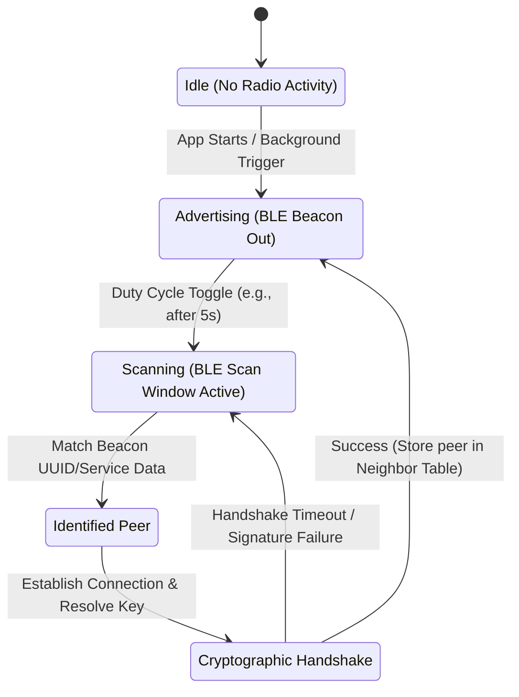

# Peer Discovery Protocol Specification

Discovery is the entry point of the Antara stack. Before messages can be routed or synchronized, devices must announce their presence and scan for neighboring nodes. Because background radio scanning is a primary source of battery drain, Antara uses a highly optimized, dual-protocol discovery engine.

---

## 1. Discovery State Machine

---

## 2. Bluetooth Low Energy (BLE) Advertisements

BLE is our primary background discovery mechanism. It allows devices to broadcast advertisements containing very small payloads (typically up to 31 bytes in the advertisement packet, with an optional 31-byte scan response).

### BLE Service Advertisement Payload Layout
Antara registers a custom 16-bit Service UUID (e.g., `0xFD5A`) to identify our nodes immediately during hardware filtering.

| Byte Offset | Size | Name | Purpose |
| :--- | :--- | :--- | :--- |
| `0` | 1 byte | **Length** | Total size of the AD structure. |
| `1` | 1 byte | **AD Type** | Specifies Service Data (typically `0x16`). |
| `2 - 3` | 2 bytes | **Service UUID** | Antara Custom Service Ident (e.g., `0xFD5A`). |
| `4 - 19` | 16 bytes | **Discovery Token** | Ephemeral token representing the node's encrypted ID (`BeaconToken`). |
| `20` | 1 byte | **Capabilities** | Bitmask indicating active features (e.g., has WiFi Direct, low battery, group owner). |
| `21 - 24` | 4 bytes | **Epoch ID** | Expiry identifier checking when the current advertising token expires. |

### Battery Optimization (Duty-Cycling)
To run continuously without draining battery, the BLE scanner operates on a variable duty cycle:
*   **Active Scanning (Foreground):** Scan window = 150ms, Scan interval = 300ms (50% duty cycle).
*   **Passive Scanning (Background):** Scan window = 30ms, Scan interval = 900ms (3.3% duty cycle).
*   **Backoff Coefficient:** If no peers are discovered after 3 consecutive scan loops, the scan interval doubles, up to a maximum of 15 seconds. It resets immediately when physical movement is detected via device accelerometer sensors.

---

## 3. Wi-Fi Aware (NAN) Service Discovery

Where supported by Android hardware, Wi-Fi Aware (Neighbor Awareness Networking) allows devices to discover services directly within a local physical vicinity without joining an active AP.

*   **NAN Publish/Subscribe:** Nodes publish a service named `org.circle13.antara.sync`.
*   **Subscriber Discovery:** Nearby devices subscribe to the same service name. The Android system alerts the Antara daemon when a matching publisher is found.
*   **NAN Connection Initiation:** Senders can send small out-of-band payloads (up to 255 bytes) directly inside the NAN discovery packet. This allows routing queries to execute before a heavy Wi-Fi connection is fully negotiated.

---

## 4. Local Area Network Discovery (mDNS / DNS-SD)

If a device joins a local LAN or a local Wi-Fi hotspot, the Discovery Layer starts standard **Multicast DNS (mDNS)** and **DNS-Based Service Discovery (DNS-SD)** to locate other local peers over UDP port 5353.

*   **Service Type:** `_antara._tcp.local.`
*   **TXT Record Payload:**
    *   `node_id` = Cryptographic address hash.
    *   `ver` = Protocol version.
    *   `caps` = Binary capabilities bitmask.
