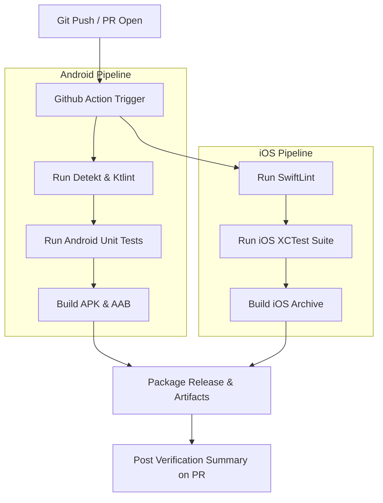

# CI/CD & Automated Pipelines Specification

Antara leverages GitHub Actions to automate linting, compilation, unit testing, device simulator matrix testing, and beta build packaging. 

Our CI pipeline enforces compilation cleanliness: **if a pull request fails to build, compile, or lint, it is strictly blocked from merging.**

---

## 1. Unified Integration Pipeline Flow



---

## 2. Android Build & Test Workflow (`.github/workflows/android.yml`)

The following YAML configuration defines the Android integration pipeline, running on Ubuntu runners:

```yaml
name: Android CI Pipeline

on:
  push:
    branches: [ main, develop ]
  pull_request:
    branches: [ main, develop ]

jobs:
  lint-and-test:
    runs-on: ubuntu-latest
    steps:
      - name: Checkout Source Code
        uses: actions/checkout@v4

      - name: Set up JDK 17
        uses: actions/setup-java@v4
        with:
          distribution: 'zulu'
          java-version: '17'

      - name: Setup Gradle Cache
        uses: gradle/actions/setup-gradle@v3

      - name: Verify Code Style (Ktlint)
        run: ./gradlew ktlintCheck

      - name: Run Static Analysis (Detekt)
        run: ./gradlew detekt

      - name: Run Unit Tests
        run: ./gradlew testDebugUnitTest

      - name: Compile Debug APK
        run: ./gradlew assembleDebug

      - name: Upload Debug APK Artifact
        uses: actions/upload-artifact@v4
        with:
          name: antara-android-debug
          path: app/build/outputs/apk/debug/app-debug.apk
```

---

## 3. iOS Build & Test Workflow (`.github/workflows/ios.yml`)

Because iOS compilation requires Apple's Xcode SDK, the iOS workflow runs on macOS runners:

```yaml
name: iOS CI Pipeline

on:
  push:
    branches: [ main, develop ]
  pull_request:
    branches: [ main, develop ]

jobs:
  build-and-test:
    runs-on: macos-14
    steps:
      - name: Checkout Source Code
        uses: actions/checkout@v4

      - name: Select Xcode Version
        run: sudo xcode-select -s /Applications/Xcode_15.3.app

      - name: Verify Code Style (SwiftLint)
        run: |
          if which swiftlint >/dev/null; then
            swiftlint
          else
            echo "warning: SwiftLint not installed, skipping."
          fi

      - name: Run Unit Tests
        run: |
          xcodebuild test \
            -scheme Antara \
            -destination 'platform=iOS Simulator,name=iPhone 15,OS=17.2' \
            -enableCodeCoverage YES

      - name: Build Xcode Archive
        run: |
          xcodebuild archive \
            -scheme Antara \
            -archivePath $RESULT_PATH/Antara.xcarchive \
            -allowProvisioningUpdates
```

---

## 4. Release Packaging & Feedback loops
Every successful push to the `main` branch compiles production-ready builds:
*   **Android App Bundle Signing:** Signed dynamically using keystore keys securely injected via GitHub Actions secrets.
*   **PR Comment Bot:** When an integration run finishes, a local GitHub Bot comments directly on the corresponding Pull Request containing:
    1.  Test coverage percentages.
    2.  Lint warning counts.
    3.  A download link for the compiled testing APK, allowing developers to immediately run physical mesh tests on mobile devices.
