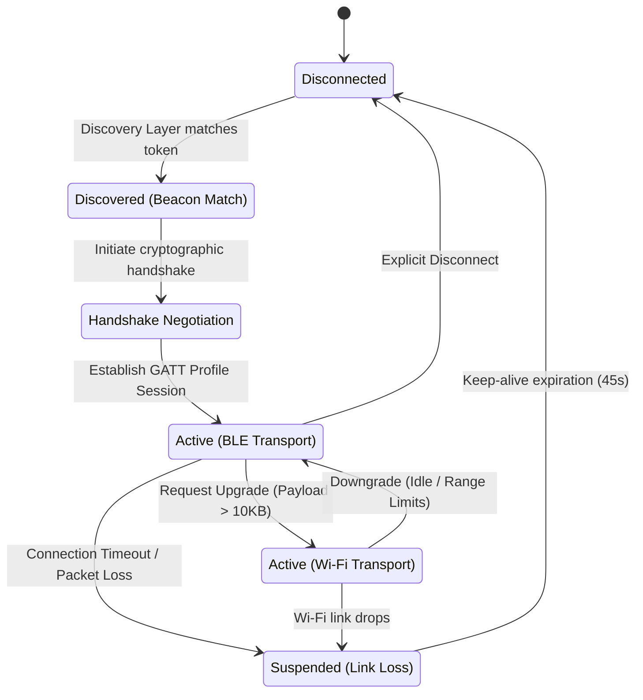

# Link-Layer Networking & Transport Manager

The Transport Layer is responsible for abstracting the differences between physical radios (BLE, Wi-Fi Direct, Wi-Fi Aware) and presenting a unified read/write socket interface to the Routing Layer. It establishes point-to-point connections, manages message serialization, and optimizes bandwidth.

---

## The Adaptive Connection Manager

The `ConnectionManager` is the core orchestrator of the Transport Layer. It maintains a pool of active connection channels and routes packets through the most efficient link.

```
+-----------------------------------------------------------+
|                     ConnectionManager                     |
|                                                           |
|  +-------------------+  +------------------------------+  |
|  | SocketPool        |  | LinkEvaluator                |  |
|  | (Active Sockets)  |  | (RSSI, Battery, Queue Depth) |  |
|  +-------------------+  +------------------------------+  |
+-----------------------------------------------------------+
        |                                       |
        v (Transport Selection)                 v (Dynamic Toggle)
+------------------+  +-------------------+  +------------------+
|    BLE Link      |  |   Wi-Fi P2P Link  |  |  Wi-Fi NAN Link  |
| (Low Throughput) |  | (High Throughput) |  | (Med Throughput) |
+------------------+  +-------------------+  +------------------+
```

---

## Socket Pooling & Lifecycle

Because building ad-hoc peer-to-point connections (especially Wi-Fi Direct group negotiation) is slow and battery-intensive, Antara avoids tearing down links immediately after data transmission.

1.  **Keep-Alive Pool:** Sockets are kept open in an idle state for a configurable period (default: 45 seconds). If a new packet is routed to the same peer within this window, it bypasses the handshake phase and transmits immediately.
2.  **Concurrency Limits:** To prevent radio congestion, the `SocketPool` enforces a maximum of:
    *   **3 concurrent active Wi-Fi Direct socket connections** (typically 1 as Group Owner, 2 as Client).
    *   **7 concurrent active BLE peripheral connections**.
3.  **Active Demotion:** If a connected peer's battery status reports `< 15%` or signal RSSI drops below `-85 dBm`, the socket is demoted to low-priority BLE-only status, freeing up Wi-Fi transceivers.

---

## Link-Layer State Machine

Each connection channel in the network pool transitions through a strict lifecycle state machine:



---

## Packet Framing & Serialization

To traverse heterogeneous links (which have varying Maximum Transmission Units, or MTU), the Transport Layer segments payloads into small, self-contained **Transport Frames**.

```
 0                   1                   2                   3
 0 1 2 3 4 5 6 7 8 9 0 1 2 3 4 5 6 7 8 9 0 1 2 3 4 5 6 7 8 9 0 1
+-+-+-+-+-+-+-+-+-+-+-+-+-+-+-+-+-+-+-+-+-+-+-+-+-+-+-+-+-+-+-+-+
|      Magic Byte (0x41)       |         Protocol Version       |
+-+-+-+-+-+-+-+-+-+-+-+-+-+-+-+-+-+-+-+-+-+-+-+-+-+-+-+-+-+-+-+-+
|                         Session ID                            |
+-+-+-+-+-+-+-+-+-+-+-+-+-+-+-+-+-+-+-+-+-+-+-+-+-+-+-+-+-+-+-+-+
|                         Frame Index                           |
+-+-+-+-+-+-+-+-+-+-+-+-+-+-+-+-+-+-+-+-+-+-+-+-+-+-+-+-+-+-+-+-+
|                         Total Frames                          |
+-+-+-+-+-+-+-+-+-+-+-+-+-+-+-+-+-+-+-+-+-+-+-+-+-+-+-+-+-+-+-+-+
|         Payload Length       |            CRC-32              |
+-+-+-+-+-+-+-+-+-+-+-+-+-+-+-+-+-+-+-+-+-+-+-+-+-+-+-+-+-+-+-+-+
|                                                               |
|                        Payload Data                           |
|                        (Max 512 KB)                           |
|                                                               |
+-+-+-+-+-+-+-+-+-+-+-+-+-+-+-+-+-+-+-+-+-+-+-+-+-+-+-+-+-+-+-+-+
```

### Frame Fields:
*   **Magic Byte (8-bit):** Identifies the byte stream as an Antara protocol packet (`0x41` = 'A').
*   **Protocol Version (8-bit):** Used to prevent serialization mismatch between different versions of the app.
*   **Session ID (32-bit):** Unique identifier generated at the start of a multi-frame transport session.
*   **Frame Index (32-bit):** Sequence identifier starting at `0`.
*   **Total Frames (32-bit):** Total number of segments in the session. Enables target assembly nodes to detect missing packets.
*   **Payload Length (16-bit):** Size of the current segment payload.
*   **CRC-32 (32-bit):** Cyclic Redundancy Check verifying payload integrity over lossy physical channels.
