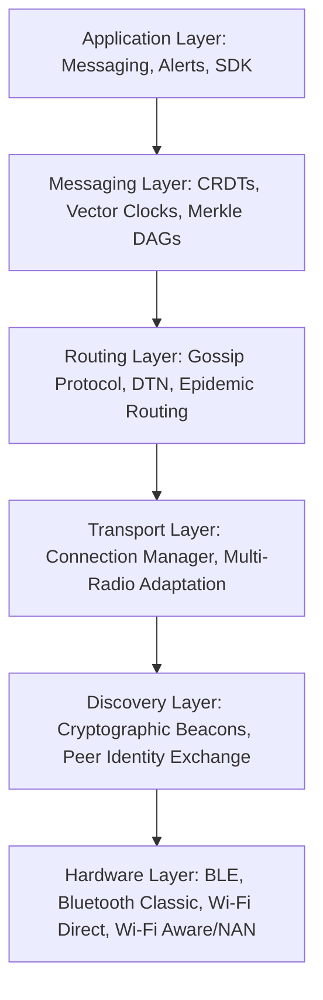

# Antara (अन्तर)

> **When networks disappear, people shouldn't.**

Antara is a decentralized communication layer that allows smartphones to discover, relay, and synchronize messages without requiring internet infrastructure or cellular connectivity. 

Traditional communication platforms treat devices as simple clients that connect to centralized servers. When the cell tower falls or the ISP fails, communication drops to zero. Antara flips this paradigm: **every device is infrastructure.** Every smartphone acts as a router, a relay, an edge storage node, and a discovery beacon. Together, they form a self-healing, delay-tolerant mesh network that operates entirely offline.

---

## The Sanskrit Meaning
In Sanskrit, **Antara (अन्तर)** represents:
*   *Distance* or *Gap*
*   *The space between two entities*

Antara's primary engineering objective is to eliminate the physical and digital "Antara" between humans when infrastructure fails.

---

## Architectural Philosophy

Instead of relying on a single radio transport, Antara implements an adaptive, multi-transport communication stack designed to traverse environments dynamically.



---

## Repository Documentation Map

We treat code implementation as a downstream artifact of rigorous design. The repository is organized into distinct RFC-style design specifications:

### 1. Vision & Core Philosophy
*   [`VISION.md`](file:///Users/nbharath/Documents/Antara/VISION.md): The long-term trajectory from a college campus MVP to a global decentralized edge SDK.
*   [`MANIFESTO.md`](file:///Users/nbharath/Documents/Antara/MANIFESTO.md): The ideological reasoning behind offline communication as a fundamental human right.
*   [`PRINCIPLES.md`](file:///Users/nbharath/Documents/Antara/PRINCIPLES.md): Core engineering constraints: Offline-first, Zero-config, Local-first, Battery-conscious, and Self-healing.
*   [`PHILOSOPHY.md`](file:///Users/nbharath/Documents/Antara/PHILOSOPHY.md): UX guidelines. The design language of invisible, quiet, and calm infrastructure.
*   [`ROADMAP.md`](file:///Users/nbharath/Documents/Antara/ROADMAP.md): Five phases of execution spanning local mesh deployment to SDK licensing.

### 2. Protocol & Routing Specification
*   [`ARCHITECTURE.md`](file:///Users/nbharath/Documents/Antara/ARCHITECTURE.md): Structural layout of the 6-layer protocol and inter-layer API boundaries.
*   [`TECH_STACK.md`](file:///Users/nbharath/Documents/Antara/TECH_STACK.md): Analysis of hardware radios (BLE, WiFi Direct, WiFi NAN) and operating system constraints.
*   [`NETWORKING.md`](file:///Users/nbharath/Documents/Antara/NETWORKING.md): Link-layer state machines, socket pooling, and adaptive connection switching.
*   [`ROUTING.md`](file:///Users/nbharath/Documents/Antara/ROUTING.md): Gossip protocols, Spray & Wait heuristic, Epidemic routing, and Delay-Tolerant Networking (DTN) mechanics.

### 3. Cryptography, Privacy & Data Sync
*   [`CRYPTOGRAPHY.md`](file:///Users/nbharath/Documents/Antara/CRYPTOGRAPHY.md): Double Ratchet encryption over Noise Protocol Framework, zero-knowledge peer discovery, and forward secrecy.
*   [`DISCOVERY.md`](file:///Users/nbharath/Documents/Antara/DISCOVERY.md): Peer discovery mechanisms via cryptographic service advertisements and BLE/NAN beacons.
*   [`MESSAGE_PROTOCOL.md`](file:///Users/nbharath/Documents/Antara/MESSAGE_PROTOCOL.md): Wire format definitions using Protocol Buffers/FlatBuffers schemas for control and message frames.
*   [`SECURITY.md`](file:///Users/nbharath/Documents/Antara/SECURITY.md): Threat modeling, Sybil attack mitigation, and rate-limiting schemes for untrusted relays.
*   [`PRIVACY.md`](file:///Users/nbharath/Documents/Antara/PRIVACY.md): Metadata protection, location obfuscation, and local database encryption (SQLCipher).
*   [`SYNC_ENGINE.md`](file:///Users/nbharath/Documents/Antara/SYNC_ENGINE.md): State replication using Conflict-Free Replicated Data Types (CRDTs) and Merkle DAG synchronization.

### 4. Implementation Guidelines
*   [`DESIGN_SYSTEM.md`](file:///Users/nbharath/Documents/Antara/DESIGN_SYSTEM.md): UI styling guides, color palettes, motion rules, and battery-optimized dark mode.
*   [`ANDROID_GUIDELINES.md`](file:///Users/nbharath/Documents/Antara/ANDROID_GUIDELINES.md): Android application architecture (Jetpack Compose, Clean Architecture, Room, and WorkManager).
*   [`IOS_GUIDELINES.md`](file:///Users/nbharath/Documents/Antara/IOS_GUIDELINES.md): iOS application architecture (SwiftUI, background core Bluetooth, and Swift Concurrency).
*   [`PRODUCT_SPEC.md`](file:///Users/nbharath/Documents/Antara/PRODUCT_SPEC.md): Product Requirements Document (PRD) for the campus MVP launch.
*   [`API_SPEC.md`](file:///Users/nbharath/Documents/Antara/API_SPEC.md): Core platform interface declarations for code integration.

### 5. Verification & Infrastructure
*   [`GITHUB_ACTIONS.md`](file:///Users/nbharath/Documents/Antara/GITHUB_ACTIONS.md): Configuration for automated builds, multi-platform test suites, and remote signing pipelines.
*   [`TESTING.md`](file:///Users/nbharath/Documents/Antara/TESTING.md): Mesh networking simulation, battery benchmark targets, and chaos testing scenarios.
*   [`RESEARCH.md`](file:///Users/nbharath/Documents/Antara/RESEARCH.md): A literature review of mesh networking, delay-tolerant routing, and comparisons with existing projects.

---

## Licensing & Architecture Governance

Antara is designed as open, foundational infrastructure. Specifications are developed via the RFC model, where any change to the protocol or system architecture must be proposed as a design revision before implementation.

---

## Getting Started & Building

### Android Subproject
To compile the Android modules, open the `android` folder in Android Studio or compile via:
```bash
cd android
# Compile debug APK binaries
gradle assembleDebug
```

### iOS SPM Package
To compile the iOS targets using Swift Package Manager, run:
```bash
cd ios/AntaraPackage
swift build
```

The targets compile and run automated builds on every push/PR via the [Antara CI workflow](.github/workflows/ci.yml).

