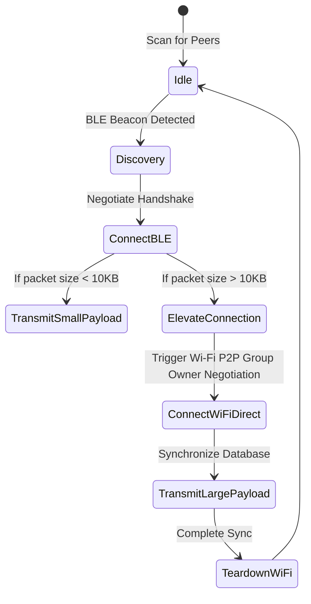

# Technology Stack & Physical Media Analysis

Antara is designed to run on consumer-grade mobile devices (Android and iOS). It abstracts and controls various built-in physical transceivers to build a robust mesh network.

---

## Physical Media Comparison Matrix

Selecting the correct radio transport requires balancing throughput, range, battery impact, and operating system API constraints.

| Technology | Range (Typical) | Max Throughput | Power Consumption | Android Support | iOS Support | Ideal Use Case |
| :--- | :--- | :--- | :--- | :--- | :--- | :--- |
| **BLE (Bluetooth Low Energy)** | 30 - 80 meters | ~2 Mbps | **Ultra-Low** | Excellent | Excellent | Background beacon discovery, heartbeats, small message framing (< 5 KB). |
| **Bluetooth Classic** | 10 - 20 meters | ~3 Mbps | Medium | Good | Restricted (requires MFi) | Medium-payload message forwarding on Android. |
| **Wi-Fi Direct (P2P)** | 100 - 200 meters | ~250 Mbps | High | Excellent | Proprietary (Multipeer Connectivity) | High-payload message sync, local database replication, media transfer. |
| **Wi-Fi Aware (NAN)** | 80 - 150 meters | ~80 Mbps | Medium | Android 8.0+ | None | Medium-throughput ad-hoc networking without leaving local Wi-Fi networks. |
| **Local Hotspot / AP** | 50 - 100 meters | ~150 Mbps | High | Good (Dynamic toggle) | Very Restricted | Bridging older devices or creating static mesh gateway anchors. |

---

## Operating System Constraints & Limitations

Developing a unified mesh protocol across Android and iOS requires addressing significant platform differences.

### 1. iOS Background Execution Constraints
Apple's iOS enforces strict runtime limitations to conserve battery:
*   **Background Scanning:** BLE advertisements can run in the background, but service UUIDs are moved into a proprietary overflow area, preventing cross-platform scanning with Android devices unless the iOS app is in the foreground.
*   **Wi-Fi Direct:** iOS does not support standard Wi-Fi Direct. Instead, it utilizes Apple's proprietary **Multipeer Connectivity Framework** (which dynamically handles Wi-Fi/Bluetooth handshakes). 
*   **Workaround:** Antara uses BLE for initial handshakes and background discovery, and coordinates point-to-point Wi-Fi handshakes dynamically when the user wakes their screen or through background task triggers.

### 2. Android Multi-Radio Concurrency
Android devices are highly flexible but suffer from hardware-specific fragmentation:
*   **Radio Coexistence:** Toggling Wi-Fi Direct while using Bluetooth can cause transmission interference on cheaper single-antenna chips. Antara includes a link controller that schedules transmissions to prevent collision.
*   **Wi-Fi Aware (NAN):** While standard on modern mid-to-high-end Android devices, it is unavailable on low-end models. The discovery engine falls back to BLE if Wi-Fi Aware is not supported by the hardware.

---

## Adaptive Transport State Machine

The Transport Layer manages connections dynamically using a multi-hop selection algorithm:

---

## Permission Matrices

To operate seamlessly without central infrastructure, Antara requires access to several platform-level hardware permissions:

### Android Permissions
*   `android.permission.BLUETOOTH_ADVERTISE` & `BLUETOOTH_CONNECT` & `BLUETOOTH_SCAN`: Bluetooth communication.
*   `android.permission.ACCESS_FINE_LOCATION`: Required by Android system APIs to return BLE and Wi-Fi scan results (as radio signals can infer user location).
*   `android.permission.CHANGE_WIFI_STATE` & `ACCESS_WIFI_STATE`: Required to spin up Wi-Fi Direct group sockets.

### iOS Permissions
*   `NSBluetoothAlwaysUsageDescription`: Background BLE advertising and scanning.
*   `NSLocalNetworkUsageDescription`: Multicast/unicast local Wi-Fi synchronization.
